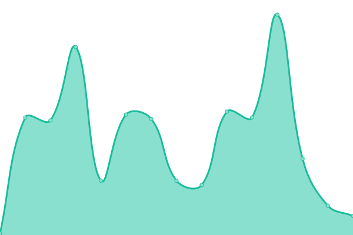
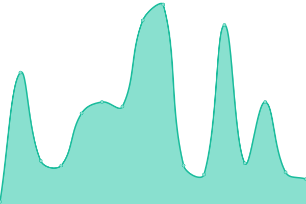

# [📈 Live Status](https://status.aspyn.io): <!--live status--> **🟧 Partial outage**

This repository contains the open-source uptime monitor and status page for [Aspyn](https://aspyn.io), powered by [Upptime](https://github.com/upptime/upptime).

With [Upptime](https://upptime.js.org), you can get your own unlimited and free uptime monitor and status page, powered entirely by a GitHub repository. We use [Issues](https://github.com/aspyn-io/status/issues) as incident reports, [Actions](https://github.com/aspyn-io/status/actions) as uptime monitors, and [Pages](https://status.aspyn.io) for the status page.

<!--start: status pages-->
<!-- This summary is generated by Upptime (https://github.com/upptime/upptime) -->
<!-- Do not edit this manually, your changes will be overwritten -->
<!-- prettier-ignore -->
| URL | Status | History | Response Time | Uptime |
| --- | ------ | ------- | ------------- | ------ |
|  [UI](https://aptive.aspyn.io/healthz) | 🟩 Up | [ui.yml](https://github.com/aspyn-io/status/commits/HEAD/history/ui.yml) | 

 353ms
     
 | 

<a href="https://status.aspyn.io/history/ui">99.87%</a>
    

|  [Customer Portal](https://customer.aptive.aspyn.io) | 🟩 Up | [customer-portal.yml](https://github.com/aspyn-io/status/commits/HEAD/history/customer-portal.yml) | 

 408ms
     
 | 

<a href="https://status.aspyn.io/history/customer-portal">100.00%</a>
    

|  [Recruit Portal](https://recruit.aptive.aspyn.io) | 🟩 Up | [recruit-portal.yml](https://github.com/aspyn-io/status/commits/HEAD/history/recruit-portal.yml) | 

 272ms
     
 | 

<a href="https://status.aspyn.io/history/recruit-portal">100.00%</a>
    

|  [Auth](https://account.aspyn.io/api/status) | 🟥 Down | [auth.yml](https://github.com/aspyn-io/status/commits/HEAD/history/auth.yml) | 

 3968ms
     
 | 

<a href="https://status.aspyn.io/history/auth">97.80%</a>
    

|  [Admin](https://api.aptive.aspyn.io/admin/v1/healthz) | 🟩 Up | [admin.yml](https://github.com/aspyn-io/status/commits/HEAD/history/admin.yml) | 

 300ms
     
 | 

<a href="https://status.aspyn.io/history/admin">99.88%</a>
    

|  [Events](https://api.aptive.aspyn.io/events/v1/healthz) | 🟩 Up | [events.yml](https://github.com/aspyn-io/status/commits/HEAD/history/events.yml) | 

 38ms
     
 | 

<a href="https://status.aspyn.io/history/events">100.00%</a>
    

|  [Events](https://api.aptive.aspyn.io/events/v1/healthz) | 🟩 Up | [events.yml](https://github.com/aspyn-io/status/commits/HEAD/history/events.yml) | 

 38ms
     
 | 

<a href="https://status.aspyn.io/history/events">100.00%</a>
    

|  [Automations](https://api.aptive.aspyn.io/automations/v1/healthz) | 🟩 Up | [automations.yml](https://github.com/aspyn-io/status/commits/HEAD/history/automations.yml) | 

 41ms
     
 | 

<a href="https://status.aspyn.io/history/automations">100.00%</a>
    

|  [Communications](https://api.aptive.aspyn.io/communications/v1/healthz) | 🟩 Up | [communications.yml](https://github.com/aspyn-io/status/commits/HEAD/history/communications.yml) | 

 85ms
     
 | 

<a href="https://status.aspyn.io/history/communications">99.88%</a>
    

|  [CRM](https://api.aptive.aspyn.io/crm/v1/healthz) | 🟩 Up | [crm.yml](https://github.com/aspyn-io/status/commits/HEAD/history/crm.yml) | 

 78ms
     
 | 

<a href="https://status.aspyn.io/history/crm">99.88%</a>
    

|  [Pay](https://api.aptive.aspyn.io/pay/v1/healthz) | 🟩 Up | [pay.yml](https://github.com/aspyn-io/status/commits/HEAD/history/pay.yml) | 

 1302ms
     
 | 

<a href="https://status.aspyn.io/history/pay">99.88%</a>
    

|  [Field Service](https://api.aptive.aspyn.io/field-service/v1/healthz) | 🟩 Up | [field-service.yml](https://github.com/aspyn-io/status/commits/HEAD/history/field-service.yml) | 

 88ms
     
 | 

<a href="https://status.aspyn.io/history/field-service">99.88%</a>
    

|  [Sales](https://api.aptive.aspyn.io/sales/v1/healthz) | 🟩 Up | [sales.yml](https://github.com/aspyn-io/status/commits/HEAD/history/sales.yml) | 

 89ms
     
 | 

<a href="https://status.aspyn.io/history/sales">99.89%</a>
    

|  [Blog](https://blog.aspyn.io) | 🟩 Up | [blog.yml](https://github.com/aspyn-io/status/commits/HEAD/history/blog.yml) | 

 166ms
     
 | 

<a href="https://status.aspyn.io/history/blog">100.00%</a>
    

|  [VROOM](https://api.aptive.aspyn.io/vroom/v1/health) | 🟩 Up | [vroom.yml](https://github.com/aspyn-io/status/commits/HEAD/history/vroom.yml) | 

 55ms
     
 | 

<a href="https://status.aspyn.io/history/vroom">99.56%</a>
    

|  [ORS (OpenRouteService)](https://api.aptive.aspyn.io/ors/v2/health) | 🟩 Up | [ors-open-route-service.yml](https://github.com/aspyn-io/status/commits/HEAD/history/ors-open-route-service.yml) | 

 2552ms
     
 | 

<a href="https://status.aspyn.io/history/ors-open-route-service">49.41%</a>
    

<!--end: status pages-->

[**Visit our status website →**](https://status.aspyn.io)

## 📄 License

- Powered by: [Upptime](https://github.com/upptime/upptime)
- Code: [MIT](./LICENSE) © [Anand Chowdhary](https://anandchowdhary.com), supported by [Pabio](https://pabio.com)
- Data in the `./history` directory: [Open Database License](https://opendatacommons.org/licenses/odbl/1-0/)
