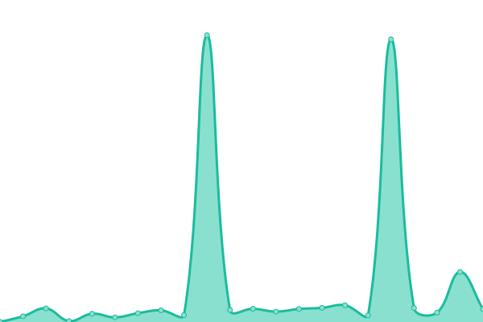

# [📈 Live Status](https://status.aspyn.io): <!--live status--> **🟩 All systems operational**

This repository contains the open-source uptime monitor and status page for [Aspyn](https://aspyn.io), powered by [Upptime](https://github.com/upptime/upptime).

With [Upptime](https://upptime.js.org), you can get your own unlimited and free uptime monitor and status page, powered entirely by a GitHub repository. We use [Issues](https://github.com/aspyn-io/status/issues) as incident reports, [Actions](https://github.com/aspyn-io/status/actions) as uptime monitors, and [Pages](https://status.aspyn.io) for the status page.

<!--start: status pages-->
<!-- This summary is generated by Upptime (https://github.com/upptime/upptime) -->
<!-- Do not edit this manually, your changes will be overwritten -->
<!-- prettier-ignore -->
| URL | Status | History | Response Time | Uptime |
| --- | ------ | ------- | ------------- | ------ |
|  [Homepage](https://aspyn.io) | 🟩 Up | [homepage.yml](https://github.com/aspyn-io/status/commits/HEAD/history/homepage.yml) | 

 231ms
     
 | 

<a href="https://status.aspyn.io/history/homepage">100.00%</a>
    

|  [UI](https://aptive.aspyn.io/healthz) | 🟩 Up | [ui.yml](https://github.com/aspyn-io/status/commits/HEAD/history/ui.yml) | 

 303ms
     
 | 

<a href="https://status.aspyn.io/history/ui">100.00%</a>
    

|  [Auth](https://account.aspyn.io) | 🟩 Up | [auth.yml](https://github.com/aspyn-io/status/commits/HEAD/history/auth.yml) | 

 295ms
     
 | 

<a href="https://status.aspyn.io/history/auth">100.00%</a>
    

|  [Admin](https://api.aptive.aspyn.io/admin/v1/healthz) | 🟩 Up | [admin.yml](https://github.com/aspyn-io/status/commits/HEAD/history/admin.yml) | 

 277ms
     
 | 

<a href="https://status.aspyn.io/history/admin">100.00%</a>
    

|  [CRM](https://api.aptive.aspyn.io/crm/v1/healthz) | 🟩 Up | [crm.yml](https://github.com/aspyn-io/status/commits/HEAD/history/crm.yml) | 

 294ms
     
 | 

<a href="https://status.aspyn.io/history/crm">100.00%</a>
    

|  [Pay](https://api.aptive.aspyn.io/pay/v1/healthz) | 🟩 Up | [pay.yml](https://github.com/aspyn-io/status/commits/HEAD/history/pay.yml) | 

 192ms
     
 | 

<a href="https://status.aspyn.io/history/pay">100.00%</a>
    

|  [Audit-API](https://api.aptive.aspyn.io/audit/v1/healthz) | 🟩 Up | [audit-api.yml](https://github.com/aspyn-io/status/commits/HEAD/history/audit-api.yml) | 

 61ms
     
 | 

<a href="https://status.aspyn.io/history/audit-api">100.00%</a>
    

|  [Audit-Daemon](https://api.aptive.aspyn.io/audit/daemon/healthz) | 🟩 Up | [audit-daemon.yml](https://github.com/aspyn-io/status/commits/HEAD/history/audit-daemon.yml) | 

 55ms
     
 | 

<a href="https://status.aspyn.io/history/audit-daemon">100.00%</a>
    

|  [Field Service](https://api.aptive.aspyn.io/field-service/v1/healthz) | 🟩 Up | [field-service.yml](https://github.com/aspyn-io/status/commits/HEAD/history/field-service.yml) | 

 198ms
     
 | 

<a href="https://status.aspyn.io/history/field-service">100.00%</a>
    

<!--end: status pages-->

[**Visit our status website →**](https://status.aspyn.io)

## 📄 License

- Powered by: [Upptime](https://github.com/upptime/upptime)
- Code: [MIT](./LICENSE) © [Anand Chowdhary](https://anandchowdhary.com), supported by [Pabio](https://pabio.com)
- Data in the `./history` directory: [Open Database License](https://opendatacommons.org/licenses/odbl/1-0/)
